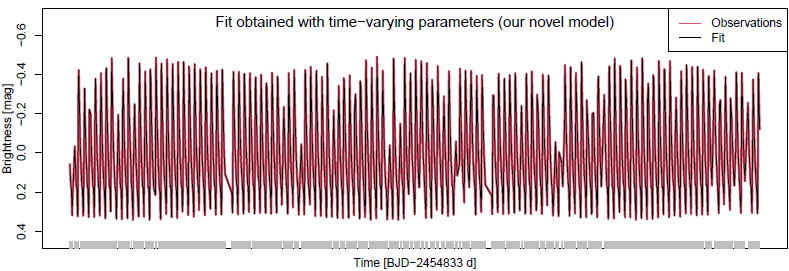

# Portfolio

## [Model for Periodic Variable Stars](https://github.com/DarlinSoto/Modulation-models)
This repository includes codes in R software to reproduce the figures in the paper Motta, G., D. Soto, and M. Catelan (2022, January). Periodic variable stars modulated by time-varying parameters. ApJ 925(1), 73.

---

© 2020 Khanh Tran. Powered by Jekyll and the Minimal Theme.

